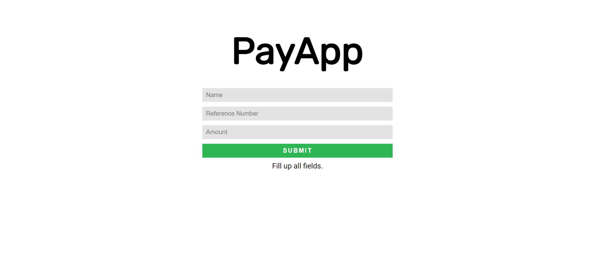
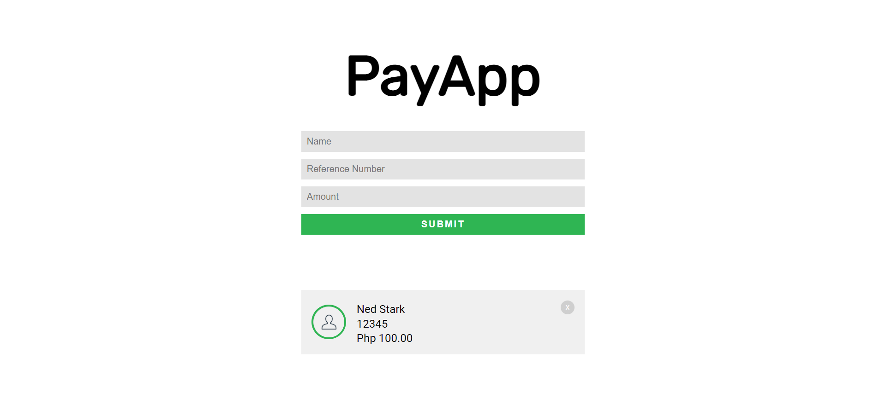

# ccapdev-2122t2-mc03
Mini Challenge 3 for CCAPDEV2122T2

## General Instructions
- **READ THE INSTRUCTIONS FIRST BEFORE PROCEEDING!**
- You are provided with a skeleton code for this Mini-Challenge. You are **not encouraged** to modify any part of the code unless specified. Editable parts of code are marked with `TODO` comments.
- For any clarifications, ask your instructor.

## Local Set Up
- Make sure MongoDB is installed and running.
- Run `npm install` after [downloading the contents of the repository](https://github.com/nromblon/ccapdev-mc03/archive/refs/heads/master.zip).
- To run the application, execute `node index.js` or `npm start`

## Submission Details
- Place all necessary files in a zip file.
- **Do not include the `node_modules` folder**
- Submit the zip file via AnimoSpace.

## Content
- [`controllers`](controllers) - This folder contains files which defines callback functions for client requests.
- [`misc`](misc) - This folder contains images used in the [`README.md`](README.md) file.
- [`models`](models) - This folder contains files for database modeling and access.
- [`public`](public) - This folder contains static assets such as css, js, and image files.
- [`routes`](routes) - This folder contains files which describes the response of the server for each HTTP method request to a specific path in the server.
- [`views`](views) - This folder contains all hbs files to be rendered when requested from the server.
- [`index.js`](index.js) - The main entry point of the web application.

## Challenge Description
You are to create a web application which simulates an online payment transaction tracker.

When a client requests for the root path, i.e. `/`, the server should display [`views/index.hbs`](views/index.hbs). Your web browser should display the screen below:

The web application accepts three inputs - a name, a reference number, and an amount. When the user submits the form, the web application first checks if all fields are filled. Sample user input:

Upon clicking the submit button, if at least one of the form fields is not filled-up, display the error message `Fill up all fields`. No need to highlight the fields.

The picture below shows the error message when at least one of the form fields is not filled-up:

The web application then saves the values in the database, then display the values in [`views/index.hbs`](views/index.hbs). Use [`views/partials/card.hbs`](views/partials/card.hbs) to render the `
` for each transaction. Upon submitting the form, the transaction should be displayed immediately **without refreshing the page**. Upon submitting the form, the fields must be emptied.

**HINT:** the client should communicate with the server asynchronously, thus data must be **fetched** from the server.

**HINT:** The server can render the handlebars template and send the rendered HTML partial. See the [express documentation on `res.render`](https://expressjs.com/en/api.html#res.render) to know more.

The picture below shows how the web application should display the values that we have entered earlier:

Each transaction may be removed using the `X` button on the upper right of the `
`. Upon clicking the `X` button, the web application deletes the transaction from the database, then removes the corresponding `
` of the transaction from [`views/index.hbs`](views/index.hbs). This operation should be done **without refreshing the page**.

Note that the reference number should be [**UNIQUE**](https://mongoosejs.com/docs/schematypes.html#schematype-options) for each transaction - no two transactions may have the same reference number. Thus, you are required to check if the current value entered by the user in the `refno` text field has not yet been used by any other transaction in the database. You need to check this **EVERY TIME** the user enters a number in the `refno` text field.

If the current value in the `refno` text field **IS IN THE DATABASE**:
- Change the background color of the `refno` text field to `red`.
- Display the error message `Reference number already in the database` in the `
` element in [`views/index.hbs`](views/index.hbs).
- Disable the `submit` button.

Else, if the current value in the `refno` text field **IS NOT YET IN THE DATABASE**:
- Change the background color of the `refno` text field back to `#E3E3E3`
- Remove the error message in the `
` element in [`views/index.hbs`](views/index.hbs).
- Enable the `submit` button.

The picture below shows the changes in the form if the current value in the `refno` text field is already in the database:

If ever we refresh the web application, all transactions in the database should be displayed.

You are already provided with the skeleton code organized in the MVC architecture. Your task is to study the web application and complete the code of the files below. You are **not encouraged** to modify other files except the files below. Editable parts of code are marked with `TODO` comments, where you can insert your code.
- [`controllers/controller.js`](controllers/controller.js)
- [`models/TransactionModel.js`](models/TransactionModel.js)
- [`public/js/index.js`](public/js/index.js)
- [`views/index.hbs`](views/index.hbs)

If you wish to proceed with a different implementation, make sure that the specification requirements are still met.
Goodluck and stay safe! :sunglasses:

## Rubric
Kindly check this [file](misc/rubric.pdf) for the rubric for grading.

## References
Maximize the materials uploaded for class and the resources readily available on the internet.

* [Fetch API](https://developer.mozilla.org/en-US/docs/Web/API/Fetch_API/Using_Fetch) documentation
* [Mongoose SchemaTypes](https://mongoosejs.com/docs/schematypes.html) documentation
* [ccapdev-mongoose](https://github.com/arvention/ccapdev-mongoose) code sample
